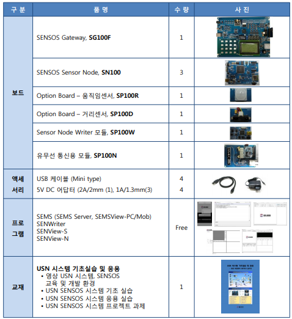
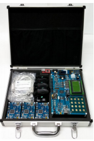

# SENSOS 교육/개발 시스템

### MyUSN 소개
- SENSOS(Seloco USN SOC Solutin)
  - 셀로코(주)에서 개발한 유무선 센터 네트워크 SOC(System On Chip) 및 시스템 솔루션
- MyUSN Station
  - SG100F 게이트웨이와 SN100S 센서노드로 구성
    - SG100F : FPGA에 근거한 센서 네트워크 게이트웨이 플랫폼
    - SN100S : UNS SOC로 구현한 센서 노드
  - 각 보드 모델며으이 끝자리 'F'와 'S'는 적요오딘 기술을 구분하여 FPGA 기반 또는 SOC기반임을 의미
    - FPGA (Field Programmable Gate Array) :   설계 가능한 논리 소자와 프로그래밍이 가능한 내부 회로가 포함된 반도체  
    - SOC (System On Chip) :   단일 칩 시스템으로 하나의 집적회로에 집적된 컴퓨터나 전자 시스템 부품을 가리킴  
- 범용 8bit MCU와 표준 JPEG encoder가 하나의 칩에 통합된 영상처리 프로세서 기반의 플랫폼
- USN(Ubiquitous Sensor Network) 환경에서 발생하는 다양한 정보 수집 및 제공을 위한 유무선 센서 네트워크 시스템 개발용 플랫폼

### MyUSN 특징
- USN 교육을위한 표준 플랫폼 지원
- 센서 네트워크용 임베디드 OS SenQ51(ETRI 기술이전 : NanoQplus를 8051 MCU에 포팅)
- 홈 네트워크, 빌딩 관리, 환경 모니터링 등 다양한 응용 센서 제공
- 간편한 칩 안테나를 적용한 RF(Radio Frequency) 모듈
- 높은 전송 속도, 신뢰성을 보장하는 유선 Ethernet 통신 지원
- 확장성, 개방성을 보장하는 무선 RF(Radio Frequency) 통신 지원
- 이미지센서 기반의 영상과 환경 센서를 융합한 복합 기술 지원

### MyUSN 구성
- MyUSN은 다양한 센서 네트워크 응용에 활용할 수 있도록 다양한 센서와 네트워크 인터페이스 지원
- MyUSN을 구성하는 패키지 목록     
- MyUSN 패키지     
- **SG100F**
  - FPGA 기반의8051 MUC와 JPEG encoder를 중심으로 UART, Ethernet, ZigBee, WiFi 등의 통신 모듈과 오도, 조도, 연기, 기압, 동작, 거리, 터치, 온습도, 이미지 등의 센서 모듈 및 LCD, LED와 Push Switch 등 다양한 입출력 소자들 포함
  - 메모리맵
    - SG100F의 FPGA에는 8bit MCU인 SU8051과 JPEG encoder가 내장되어 있음
    - 64kByte의 프로그램 메모리와 64kByte의 외부 데이터 메모리를 갖고 있음
    - 프로로그램 메모리 : 사용자가 만든 응용 프로그램이 저자오디는 메모리, Pm39LV010 Flash 메모리 적용
    - 외부 데이터 메모리 : 프로그램 수행 중 필요한 데이터 저장용 메모리, IDT71V124SA SRAM 적용
    - 데이터 메모리 : 8000h ~ FFFFh (9p ~ 11p)
      - E000h ~ FFFFh : Ethernet 통신 데이터 수신용 내부 buffer 영역
      - C000h ~ DFFFh : Ethernet 통신 데이터 송신용 내부 buffer 영역
      - A300h ~ A3FFh : RTC(Real Time Clock) 모듈 구동을 위한 영역
      - A000h ~ A2FFh : IO Select 영역
      - 9400h ~ 97FFh : 간접 어드레싱 방식에 의한 JPCON 제어 영역
      - 8000h ~ 8FFFh : Ethernet 제어 관련 영역
  - Clock 인터페이스
    - SG100F는 안정적인 동작 클럭(Clock) 공급을 위해 48MHz OSC를 이용
    - FPGA 내부에서 클럭을 관리하는 리소스인 DCM(Digital Clock Management) 모듈을 통하여 22.1184MHz로 변환시켜 MCU 블록과 JPEG 블록에 제공
    -  SU8051 MCU와 JPEG encoder의 동작 주파수는 22.1884MHz이며, CMOS 이미지 센서 모듈에는 22.1184MHz의 클럭이 공급됨
  - 센서부
    - SG100F에는 총 9종의 센서가 장착되어 있음
    - FPGA에 직접 연결되어 있는 CMOS 이미지 센서와 온습도 센서를 제외하고 기압, 온도, 조도, 움직임, 연기, 거리, 터치 세서는 아날로그 출력값을 갖기 때문에 별도의 ADC IC와 연결되어 있음
    - [각 센서들의 인터페이스와 특징](https://github.com/Kim-SuBin/USN_system_study/blob/master/sensor.md)
  - 통신부
  - 입출력부
- **SN100S**
- **MyUSN 하드웨어 연결**
